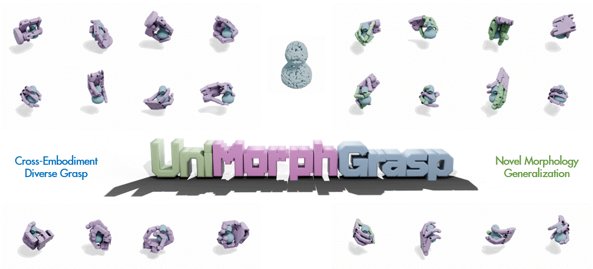
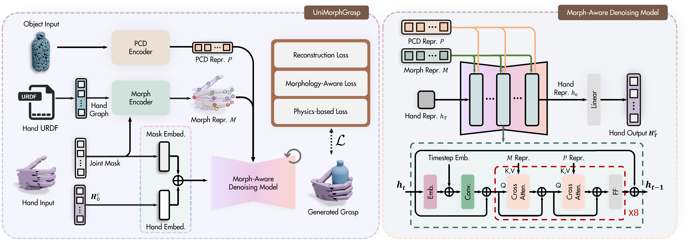
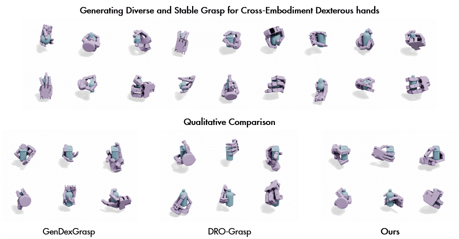
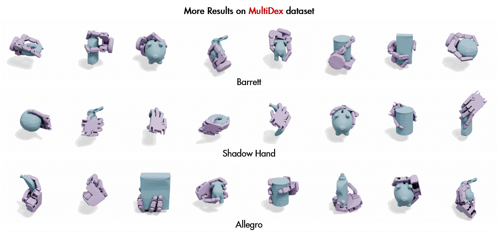
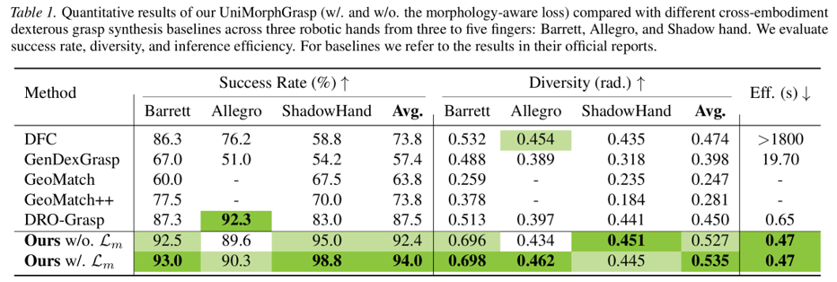
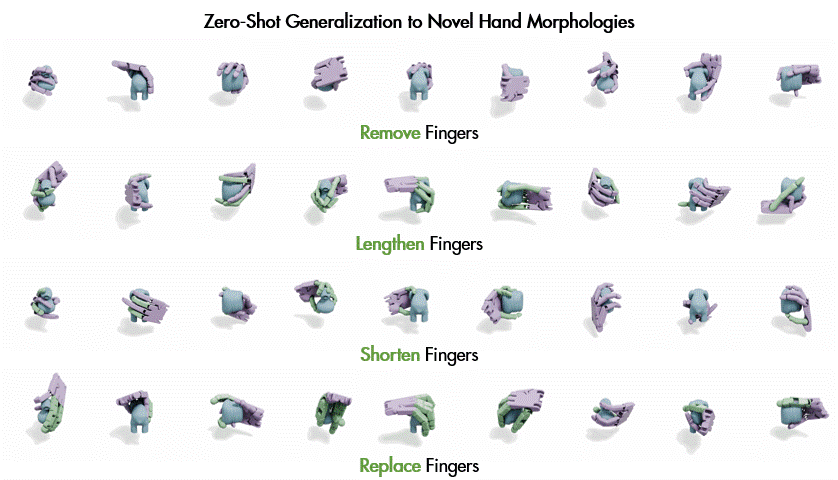
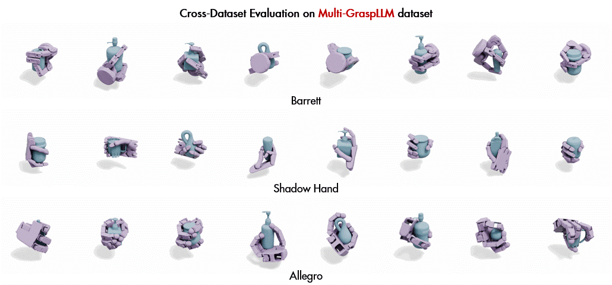
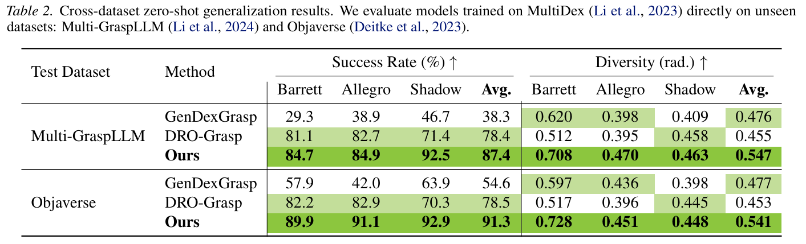
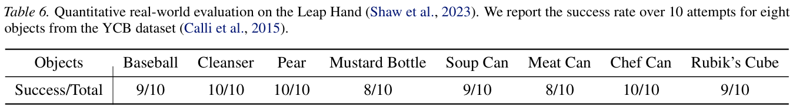

UniMorphGrasp: Diffusion Model with Morphology-Awareness for Cross-Embodiment Dexterous Grasp Generation

 

We present UniMorphGrasp, a diffusion model with morphology-awareness that can generate diverse cross-embodiment grasps and generalize to novel morphologies.

 
 
 
 

Abstract

 

Cross-embodiment dexterous grasping aims to generate stable and diverse grasps for robotic hands with varying structures. Existing methods are either hand-specific, computationally prohibitive, or fail to generalize beyond the training distribution when encountering novel hand structures. Motivated by the observation that dexterous hands inherently possess graph-structured morphologies, we propose UniMorphGrasp, a morphology-aware diffusion model that integrates explicit morphological information into the generative process for cross-embodiment dexterous grasp synthesis. Our approach first maps diverse hand structures into a unified human-like hand representation, and then employs a morphology-aware encoder that conditions grasp generation on graph-structured morphological features. We further introduce a morphology-aware loss function that leverages hierarchical kinematic relationships to guide training. Extensive experiments demonstrate that UniMorphGrasp achieves state-of-the-art performance on existing benchmarks and successfully generalizes to novel hand structures in a zero-shot way, enabling practical cross-embodiment grasp deployment.

 
 

  
 

Method

 

(Left) The overview of our proposed UniMorphGrasp for cross-embodiment dexterous grasp generation. Given an object point cloud and an arbitrary hand morphology extracted from its URDF specification (mapped to a pre-defined canonical hand format), we employ a morphology encoder to extract morphology representations from the hand's joint structure. The hand pose (noised via a diffusion scheduler in training) is embedded through a linear layer, and concatenated with its active joint mask embedding to obtain the hand representation. This representation is then processed through a morphology-aware denoising model, where the iterative process is conditioned on both the morphology representation and the point cloud representation extracted via a Point Transformer. The entire framework is trained using a morphology-aware loss function. (Right) The structure of our morphology-aware denoising model, which is conditioned on the encoded morphology and the point cloud representations via cross-attention.

 
 

  
 

Method Performance

 

UniMorphGrasp can generate stable and diverse grasps for cross-embodiment dexterous hands.

  

More results generated by our UniMorphGrasp on the MultiDex dataset.

  

Quantitative comparison of our UniMorphGrasp (w/. and w/o. the morphology-aware loss) with different cross-embodiment dexterous grasp synthesis baselines across three robotic hands from three to five fingers: Barrett, Allegro, and Shadow hand.

  

Qualitative comparison with baselines 1) GenDexGrasp and 2) DRO-Grasp, where our results demonstrate superior surface conformity and stable form-closure.

 
 

  
 

Zero-Shot Generalization to Novel Hand Morphologies

 

Topological Variations: We selectively remove fingers of the Shadow hand.

  

Geometrical Variations: We scale the finger lengths by factors of 1.5× (lengthened).

  

Geometrical Variations: We scale the finger lengths by factors of 0.8× (shortened).

  

Embodiment Variations: We replace Shadow Hand fingers with Allegro Hand fingers to introduce embodiment changes in joint axis, joint limits, and link geometries.

 
 

  
 

Cross-Dataset Results

 

We conduct cross-dataset evaluations on the Multi-GraspLLM and Objaverse datasets to evaluate the zero-shot generalization capability of our model.

 

Visualizations of cross-embodiment grasps synthesized by UniMorphGrasp on the Multi-GraspLLM dataset.

  

Visualizations of cross-embodiment grasps synthesized by UniMorphGrasp on the Objaverse dataset.

  

Cross-dataset zero-shot generalization results. We evaluate models trained on MultiDex directly on unseen datasets: Multi-GraspLLM and Objaverse.

 
 

  
 

Real-World Experiments

 

We validate UniMorphGrasp in real-world scenarios using a UR5e arm equipped with a Leap Hand.

 

Real-world grasping demonstrations on the Leap Hand.

  

Quantitative real-world evaluation on the Leap Hand. We report the success rate over 10 attempts for eight objects from the YCB dataset.

